# Unity Game Development Summary

| Field | Detail |
|---|---|
| **Game Title** |IN=SOMNIA|
| **Student Name(s)** |KhoiC|
| **Class / Course** |10CT1 / Computer Technology|
| **Repository** |https://github.com/TempeHS/2026CT_GameDesign_SuperGame_Khoi.C/tree/main|
| **Unity Version** |6000.0.58f1|
| **Document Version** |0.1|
| **Date** |27/08/2026|

---

## Table of Contents
1. [Game Overview](#1-game-overview)
2. [Video Walkthrough](#2-video-walkthrough)
3. [Game Mechanics](#3-game-mechanics)
4. [Visual Features](#4-visual-features)
5. [Audio Design](#5-audio-design)
6. [User Interface & HUD](#6-user-interface--hud)
7. [Scene & Level Design](#7-scene--level-design)
8. [Scripts & Programming](#8-scripts--programming)
9. [Development Techniques & Tutorials Acknowledged](#9-development-techniques--tutorials-acknowledged)
10. [Third-Party Content Acknowledgements](#10-third-party-content-acknowledgements)
11. [Challenges & Solutions](#11-challenges--solutions)
12. [Branch Development Summary](#12-branch-development-summary)

---

## 1. Game Overview

### 1.1 Genre
Action

### 1.2 Target Audience
People aged 13-24 years, as mental health is prominent in this age range.

### 1.3 Game Summary
My game will be a 2D scrolling platformer that explores mental health issues. In the game, you will play as a person suffering from various mental health problems and you must explore their subconsciousness to help them. You must navigate through obstacles and puzzles to relieve mental strain on the character. The game should be in a pixel art style to represent the disconnection from reality, and its core mechanic is to explore your vices and resolve them.

### 1.4 Win / Loss Conditions
| Condition | Description |
|---|---|
| Win |Defeat the boss of the level.|
| Loss |Lose all your hearts.|

### 1.5 Platform & Build Settings
| Setting | Detail |
|---|---|
| Target Platform |Windows|
| Resolution |1920x1080|
| Build Type |Development|

---

## 2. Video Walkthrough

### 2.1 Full Gameplay Walkthrough

<!--
  Embed a YouTube/Vimeo video or link to a file in the repository.
  YouTube embed syntax:
  

  OR link to a local file:
  [Watch Walkthrough Video](./docs/video/walkthrough.mp4)
-->

| Field | Detail |
|---|---|
| **Video Title** |CT AT3 - Capstone Project|
| **Link / Embed** |https://youtu.be/JB0aVj6R6s4|
| **Duration** |2:42|
| **Description** |Presents the features of my game.|

### 2.2 Feature Highlight Clips

| Clip | Description | Link |
|---|---|---|
|Orb Deposit|Depositing orbs for lives makes the game much more enjoyable and open.|https://youtu.be/yheBR2mjeGM|
|Anxiety Boss|Anxiety is the final boss of the Anxiety level for IN=SOMNIA.|https://youtu.be/7XjSfnABwPo|
|Anger|Anger is the first enemy met and is still one of the most interesting.|https://youtu.be/vkmnZlHYr14g|

---

## 3. Game Mechanics

### 3.1 Core Mechanics
| ID | Mechanic | Description | Implemented In (Script/Object) |
|---|---|---|---|
| M-1 |Collect|Allows the player to collect orbs around the level.|Orb: OrbController|
| M-2 |Health|Health tracks the player's amount of lives.|Heart: HealthSystem|
| M-3 |Enemy|Jumping on enemies allows you to defeat them.|Enemy: EnemyBehaviour|
| M-4 |Lava|Lava damages the player when they step in it.|Obstacle: PlayerMovement|
| M-5 |Flare|A geyser that spews lava and damages the player.|Obstacle: FlareBehaviour|

### 3.2 Player Controls
| Action | Input (Keyboard / Controller) | Description |
|---|---|---|
|Jump|SPACE|Allows the player to jump. Jump height varies on how long the player holds the space bar.|
|Drop|S|Allows the player to drop through one way platforms.|
|Horizontal Movement|A / D|Lets the player move left and right.|

### 3.3 Physics & Collision
| Feature | Description |
|---|---|
|Tilemap|A grid of tiles that the player walks on.|
|Enemy|When the player jumps on an enemy, a small bounce is applied.|
|Orbs|When the player collides with an orb it disappears and adds to the count.|

### 3.4 Game Loop
| Stage | Description |
|---|---|
| Start / Initialisation | |
| Core Loop | |
| Win / End State | |
| Restart | |

### 3.5 Scoring & Progression
| Element | Description |
|---|---|
| Scoring System | |
| Difficulty Progression | |
| Unlockables / Levels | |

---

## 4. Visual Features

### 4.1 Particle Effects

| Effect Name | Purpose | Screenshot |
|---|---|---|
|WalkFX|The effect is applied when the player falls or turns.|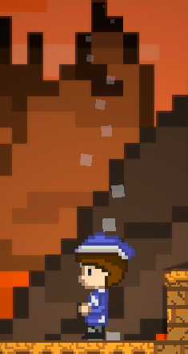|
|EnemyParticleFX|The splatter of killing the enemy|!Effect Name|
|FlareParticleFX|Spewing lava recreated with particles|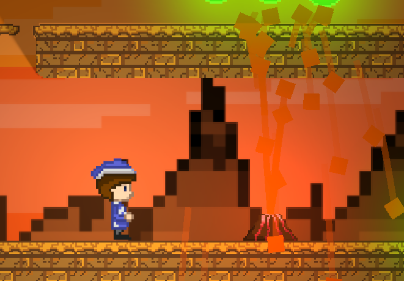|
|HitFX|Particles to indicate the player was hit|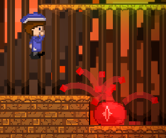|

---

### 4.2 Cut Scenes & Cinematics

| Cut Scene | Trigger | Description | Screenshot / Still |
|---|---|---|---|
| | | | |
| | | | |
| | | | |

---

### 4.3 Animations

| Animation | Object / Character | Description | Screenshot |
|---|---|---|---|
|PlayerWalk|Player|The animation of the player's horizontal movement.|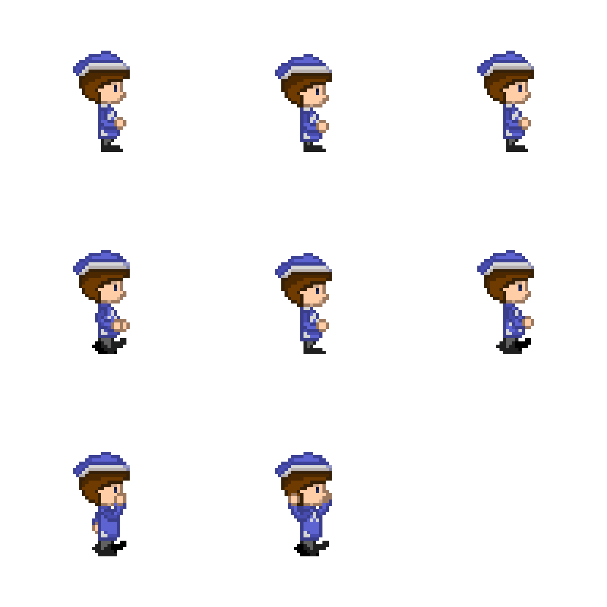|
|AngerJump|Enemy|The animation of the enemy jumping.|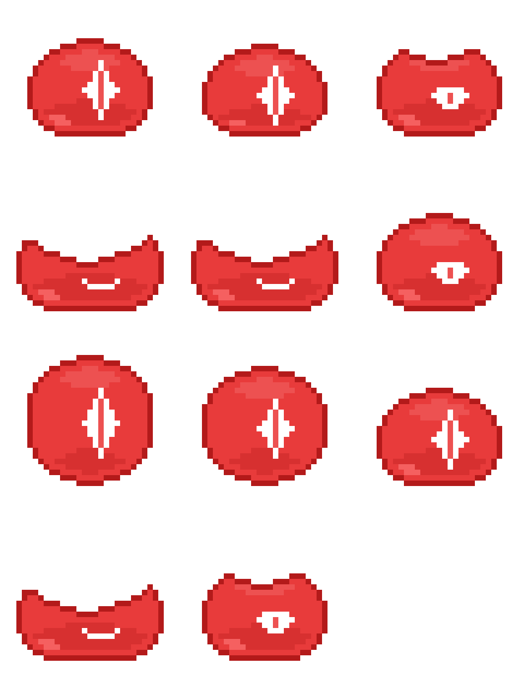|
|HeartLoss|Heart|The animation for losing a heart.|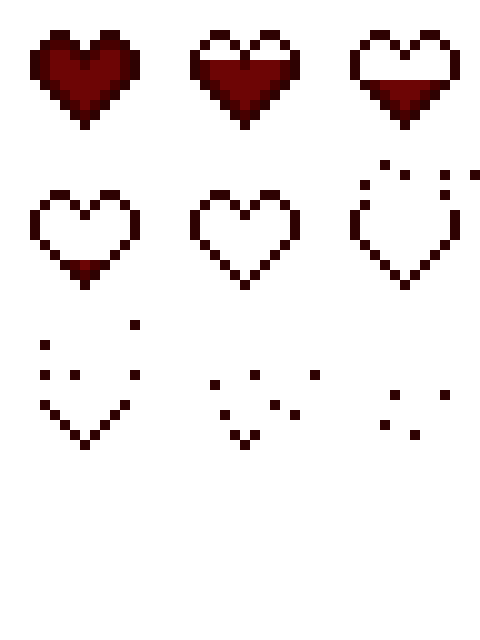|

---

### 4.4 Lighting & Post-Processing

| Feature | Description | Screenshot |
|---|---|---|
|ShadowCaster2D|Casts shadows around the level.|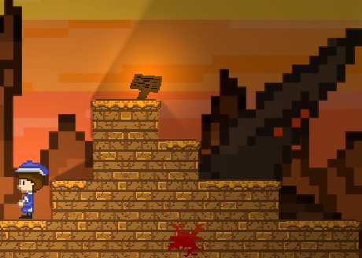|
|Spot Light|Shines light in one specific spot.|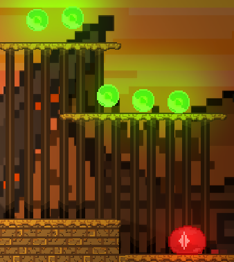|
|Lava Light|Creates a light game object at every lava tile.|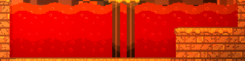|

---

### 4.5 Shaders & Materials

| Shader / Material | Applied To | Description | Screenshot |
|---|---|---|---|
|NoFriction|Player|It removes the friction from collisions||
|OrbMaterial|Orb|Gives the orbs a texture.|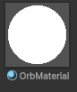|
| | | | |

---

### 4.6 Additional Visual Screenshots

<!--
  Add any other notable screenshots here.
  Syntax: 
-->

| Description | Screenshot |
|---|---|
|Parallax Background|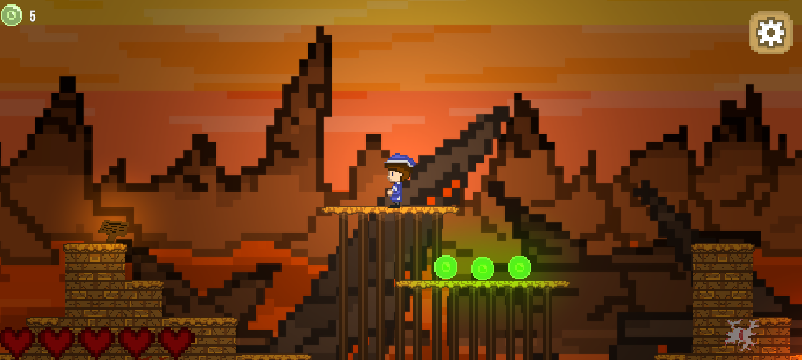|
| | |
| | |

---

## 5. Audio Design

### 5.1 Music
| Track | Scene / Trigger | Source / Composer |
|---|---|---|
|WhitePalace|Main Menu|Composed by Christopher Larkin in 'Hollow Knight'.|
|Confined|Anxiety Level|Composed by Mekbok in 'The Foundation'.|

### 5.2 Sound Effects
| Sound Effect | Trigger | Source |
|---|---|---|
|UIHover|When a UI element is hovered.|400 Sounds Pack by Chequered Ink - Itch.io|
|UIClick|When a UI element is clicked.|400 Sounds Pack by Chequered Ink - Itch.io|
|Collect|When an orb is collected.|gold_pickup.wav by killersmurf96 - Freesound.org|
|Splat|When an enemy is killed.|splat_005.wav by yottasounds - Freesound.org|

### 5.3 Audio Implementation
| Feature | Description |
|---|---|
| Audio Mixer / Groups | |
| Spatial / 3D Audio | |
| Dynamic Audio |Music is changed in stages in the anxiety boss stage.|

---

## 6. User Interface & HUD

### 6.1 HUD Elements
| Element | Purpose | Screenshot |
|---|---|---|
|Start|Allows the player to start the game.|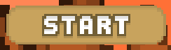|
|Settings|Allows the player to control volume and return to the main menu.|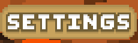|
|Volume|Adjusts the global volume of the game.|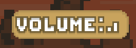|

### 6.2 Menus
| Menu | Purpose | Screenshot |
|---|---|---|
| Main Menu |Serves as a navigational panel before starting the acutal game.|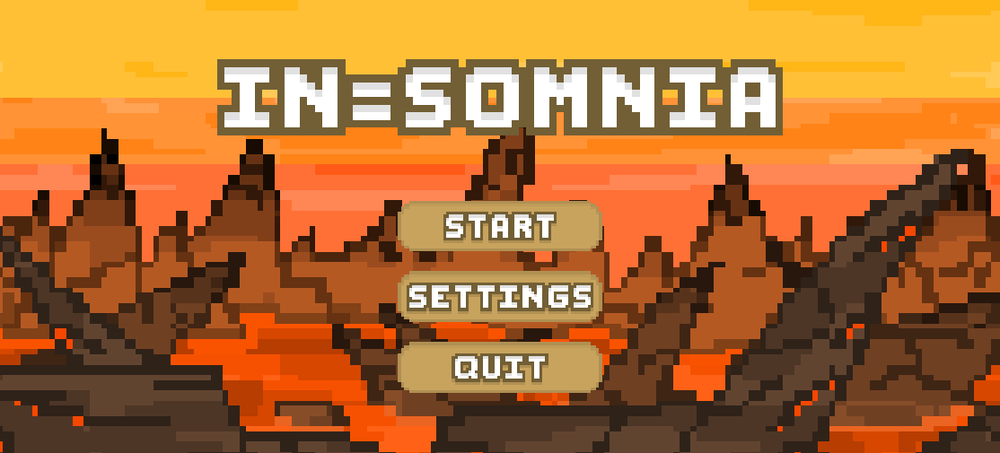|
| Pause Menu |Lets the player customise their experience and return to the main menu safely.|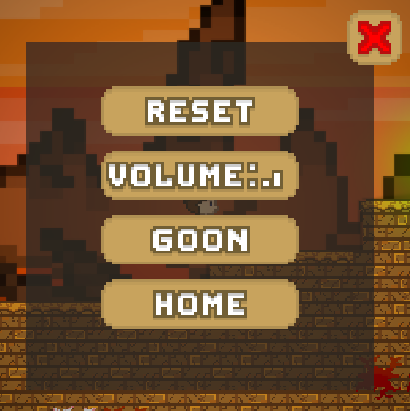|
| Anchor Minigame |Allows the player to play the anchor minigame to unlock the exit.|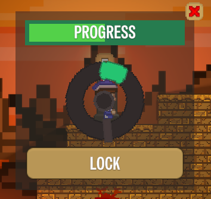|

---

## 7. Scene & Level Design

### 7.1 Scene List
| Scene Name | Purpose | Description |
|---|---|---|
|MainMenu|Holds the main menu of the game.|The main menu contains the start, settings, and quit buttons.|
|EvilLevel|The level that the player starts on.|Has the main gameplay of the game.|

### 7.2 Level / Environment Screenshots
| Level / Area | Description | Screenshot |
|---|---|---|
| | | |
| | | |
| | | |

> Add screenshot images using: ``

### 7.3 Scene Management
| Feature | Description |
|---|---|
| Scene Loading Method | |
| Persistent Data Between Scenes | |
| Scene Transition Effects | |

---

## 8. Scripts & Programming

### 8.1 Script Summary
| Script Name | Attached To | Responsibility |
|---|---|---|
|PlayerMovement|Player|Player movement and main controller.|
|BGController|Parallax|Controls parallax background elements.|
|EnemyBehaviour|Enemy|Allows the enemy to move around and jump.|
|OrbController|Orb|Allows orbs to be collected.|
|MainMenu|Main Menu Elements|Individually controls each of the UI elements.|

### 8.2 Key Algorithms / Logic
| Feature | Script | Description |
|---|---|---|
|Damage| | |
| | | |
| | | |

### 8.3 Design Patterns Used
| Pattern | Where Applied | Justification |
|---|---|---|
|Audio Manager|Applied in multiple game objects to refer back to the Audio Manager|Referring back to the Audio Manager allows you to play sounds from any game object.|
| | | |
| | | |

---

## 9. Development Techniques & Tutorials Acknowledged

> List every tutorial, course, video, or article that informed or guided your implementation. Include what you used it for and what you changed or adapted.

| # | Title | Author / Creator | URL / Source | What You Used It For | What You Changed / Adapted |
|---|---|---|---|---|---|
| 1 |Quick Shadow Creation with One Click - Unity2D Auto SHADOW CASTER 2D creator|Rehope Games|https://www.youtube.com/watch?v=n3tgimClTrI|I used it to create shadows in my level and modify lights for different objects.|I added a Game Object Brush to automatically generate lights in my scene.|
| 2 |Make Your MAIN MENU Quickly! - Unity UI Tutorial For Beginners|Rehope Games|https://www.youtube.com/watch?v=DX7HyN7oJjE|I used it to make my main menu and UI elements in the level.|I added UI animations and improved the settings panel.|
| 3 |How to Add MUSIC and SOUND EFFECTS to a Game in Unity - Unity 2D Platformer Tutorial #16|Rehope Games|https://www.youtube.com/watch?v=N8whM1GjH4w|I used it to start music in my game and implement sound effects.|I used the sound effects for UI elements as well.|
| 4 |Dynamic Heart System - Heart Health Bar - Unity Tutorial|Hyyder Works|https://www.youtube.com/watch?v=lBRwsl25jUs|I made a heart health system to keep track of the player health.|I changed the script to generate a custom amount of hearts.|
| 5 |Easy Tilemaps and Dynamic Auto Tiling - Unity 2D|Game Code Library|https://www.youtube.com/watch?v=8UctaO5DwUE|I used this to make the tilemap that creates the level|I added tiles that have different functions like ones that damage you.|
| 6 |Adding Dust Particle Effects - 2D Platformer Unity #6|Game Code Library|https://www.youtube.com/watch?v=aEGJn5hu_qw|I used this to make the player particle effects.|I also added particle systems for the enemy and flares.|
| 7 |How to Create 2D Enemy Movement in Unity|Wild Cockatiel Games|https://www.youtube.com/watch?v=7mkD9K2nwDM|I used this guide to make a enemy that moves side by side|I also made the enemy jump every 2 second intervals.|
| 8 |How to Setup Animator and Animations in Unity 2D|Wild Cockatiel Games|https://www.youtube.com/watch?v=AdQz2wStdLY&pp=0gcJCf4LAYcqIYzv|I created my player animations for walking and jumping.|I extended it to other game objects like enemies and orbs.|

---

## 10. Third-Party Content Acknowledgements

> All third-party assets (art, audio, fonts, scripts, packages) must be listed here with their licence. Using an asset without acknowledgement may constitute academic misconduct.

### 10.1 Visual Assets
| Asset Name | Type | Creator / Source | Licence | URL | Used For |
|---|---|---|---|---|---|
| | | | | | |
| | | | | | |
| | | | | | |

### 10.2 Audio Assets
| Asset Name | Type | Creator / Source | Licence | URL | Used For |
|---|---|---|---|---|---|
|400 Sounds Pack|.wav|Chequered Ink|Non-commercial use (CC BY-NC 4.0)|https://ci.itch.io/400-sounds-pack|UI elements|
|gold_pickup|.wav|killersmurf96|For all uses (CC BY 4.0)| https://freesound.org/people/Killersmurf96/sounds/423123/|Orb pickup|
|splat 005|.wav|yottasounds|For all uses (CC0 1.0)|https://freesound.org/people/yottasounds/sounds/232135/|Enemy destroy|
|White Palace|.mp3|Christopher Larkin|Used strictly for non-commercial educational use|https://www.youtube.com/watch?v=4JWANCA-Pbw|Main menu music|
|Confined|.mp3|Mekbok|Used strictly for non-commercial educational use|https://www.youtube.com/watch?v=RSDliCJ132I&list=RDRSDliCJ132I&start_radio=1|Level music|
|Search Party|.mp3|NoLongerNull|Used strictly for non-commercial educational use|https://www.youtube.com/watch?v=ms_8Yfjcymk&list=RDms_8Yfjcymk&start_radio=1|ANXIETY boss music|

### 10.3 Scripts & Code Snippets
| Script / Snippet | Source | Licence | URL | Used For | Changes Made |
|---|---|---|---|---|---|
| | | | | | |
| | | | | | |

### 10.4 Unity Packages & Plugins
| Package Name | Version | Source | Licence | URL | Purpose |
|---|---|---|---|---|---|
| | | | | | |
| | | | | | |
| | | | | | |

### 10.5 Fonts
| Font Name | Creator / Source | Licence | URL |
|---|---|---|---|
|Special Gothic Condensed One|Alistair McCready - Google Fonts|Commercial or other use (OFL Version 1.1)|https://fonts.google.com/specimen/Special+Gothic+Condensed+One?preview.script=Latn|
| | | | |

---

## 11. Challenges & Solutions

| # | Challenge Encountered | How It Was Solved |
|---|---|---|
| 1 |Heart animations were difficult to implement because they were clones. This made them hard to animate in the script.|I did some debugging and found the root cause of why the heart animations were not being applied which was some issues involving the trigger in the animator and its behaviour.|
| 2 |The main menu buttons created were not fully scaled so they behaved strangely with the interactable buttons.|I added the button as a separate game object, making it a child of the button which allowed me to freely change the scale.|
| 3 |Lighting was difficult to integrate at first because the shadows were not applied to the tilemap which is what was being used to generate the level.|I added a shadow caster script to the tilemap and it was able to cast shadows properly.|
| 4 || |
| 5 | | |

---

## 12. Branch Development Summary

> One section per feature branch. Add or remove sections to match your repository. Branches should be named for the feature they implement e.g. `feature/player-movement`. Link each branch name directly to the branch in your GitHub repository.

---

### Branch 1 — `main`

| Field | Detail |
|---|---|
| **Branch Name** | `main` |
| **Purpose** | Stable, releasable version of the game |
| **Merged From** | |
| **Final Commit** | |

---

### Branch 2 — `feature/`

| Field | Detail |
|---|---|
| **Branch Name** |Parallax BG|
| **Feature Developed** |Parallax background|
| **Merged Into** |Main|
| **Date Started** |July 27|
| **Date Merged** |Aug 12|

#### What Was Built
I implemented the parallax background to give the game a 3D effect in a 2D space. The parallax background requires different layers to recreate a 3D effect.

#### Key Commits
| Commit Message | What Changed |
|---|---|
|wip: parallax bg|Started work on the basic parallax scripts.|
|feature: new parallax|Updated the parallax backgrounds to match the latest version.|

#### Problems Encountered & Resolved
| Problem | Resolution |
|---|---|
| | |
| | |

#### Screenshot / Evidence
<!-- Add a screenshot of the feature working -->
> ``

---

### Branch 3 — `feature/`

| Field | Detail |
|---|---|
| **Branch Name** |Level Overhaul|
| **Feature Developed** |Improved level mechanics|
| **Merged Into** |Main|
| **Date Started** |Sep 11|
| **Date Merged** |Sep 23|

#### What Was Built
The level was a bit plain and barren so I added enemies, obstacles, orb depositing, and the boss of the level.

#### Key Commits
| Commit Message | What Changed |
|---|---|
|feature: improved lighting and orb tilemap|This commit allowed me to efficiently make orbs and implemented a lighting and shadow caster system across the level, allowing me to cast shadows and create dynamic lights.|
|feature: lava spews|This added a new obstacle, Flare. Flare acts as a volcano that erupts occasionally, making my level more interesting.|
|feature: anxiety boss|This commit implemented the anxiety boss into the game and created the win and lose conditions.|

#### Problems Encountered & Resolved
| Problem | Resolution |
|---|---|
|Heart deposit was not working properly.|Changed the animation settings for the heart deposit function.|
|Anchor minigame spinner was not scaled properly.|Adjust the scaling to be a 1:1 ratio.|

#### Screenshot / Evidence
> ``

---

### Branch 4 — `feature/`

| Field | Detail |
|---|---|
| **Branch Name** | |
| **Feature Developed** | |
| **Merged Into** | |
| **Date Started** | |
| **Date Merged** | |

#### What Was Built

#### Key Commits
| Commit Message | What Changed |
|---|---|
| | |
| | |
| | |

#### Problems Encountered & Resolved
| Problem | Resolution |
|---|---|
| | |
| | |

#### Screenshot / Evidence
> ``

---

### Branch 5 — `feature/`

| Field | Detail |
|---|---|
| **Branch Name** | |
| **Feature Developed** | |
| **Merged Into** | |
| **Date Started** | |
| **Date Merged** | |

#### What Was Built

#### Key Commits
| Commit Message | What Changed |
|---|---|
| | |
| | |
| | |

#### Problems Encountered & Resolved
| Problem | Resolution |
|---|---|
| | |
| | |

#### Screenshot / Evidence
> ``

---

### Branch 6 — `feature/`

| Field | Detail |
|---|---|
| **Branch Name** | |
| **Feature Developed** | |
| **Merged Into** | |
| **Date Started** | |
| **Date Merged** | |

#### What Was Built

#### Key Commits
| Commit Message | What Changed |
|---|---|
| | |
| | |
| | |

#### Problems Encountered & Resolved
| Problem | Resolution |
|---|---|
| | |
| | |

#### Screenshot / Evidence
> ``

---

### Branch Development Overview

> Complete this summary table once all branches are finished.

| Branch Name | Feature | Date Started | Date Merged | Status |
|---|---|---|---|---|
| `main` | Stable release | | | |
| `feature/` | | | | |
| `feature/` | | | | |
| `feature/` | | | | |
| `feature/` | | | | |
| `feature/` | | | | |

---

> **Student Declaration:** All work submitted is my own except where explicitly acknowledged above.
